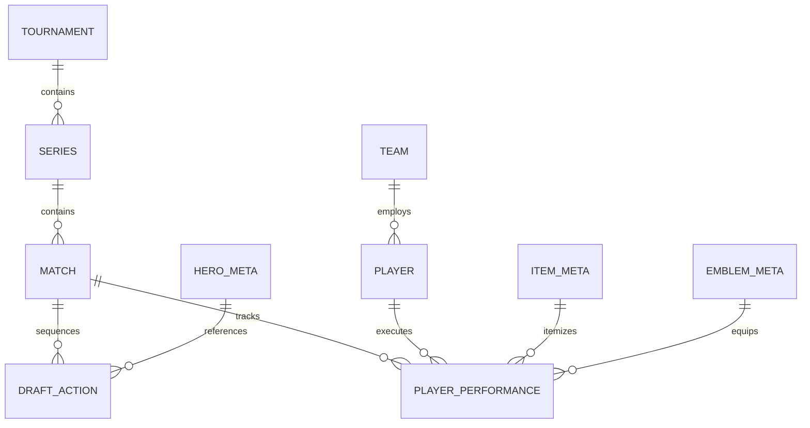

# MLBB-API — Mobile Legends: Bang Bang Knowledge Base & Esports Match Datasets

[](https://opensource.org/licenses/MIT)
[](https://github.com/sukirman1901/MLBB-API)
[](#-data-completeness--status)

Welcome to **MLBB-API**, an open-source Mobile Legends: Bang Bang (MLBB) Attribute Database, Esports Match Datasets, and Analytics Engine maintained by **sukirman1901**.

---

## 🏗️ Project Architecture & Long-Term Roadmap

```text
Static Game Knowledge (V0: Heroes, Items, Emblems)
        ↓
Esports Match Dataset (V1: Tournaments, Teams, Players, Matches, Draft Sequences)
        ↓
Draft Analytics (V2: Pick/Ban Priority, Response Picks, Side Win Rates)
        ↓
Meta Tracing (Dynamic Meta Shifts & Patch Performance)
        ↓
In-Game Tracking (Timeline & Objective Events)
        ↓
VOD / Event Dataset (Computer Vision & Timestamp Events)
        ↓
Data Science & ML Models (Win Prediction & Draft Optimizer)
        ↓
AI Analyst (Scouting Reports & Tactical Recommender)
```

---

## 🎮 Why This Esports Dataset Exists

Static game knowledge alone (hero stats, item passives) cannot reveal how competitive games are won or lost.

The **Esports Match Dataset** establishes a bridge between static knowledge and real competitive performance:

* **Static Game Knowledge (V0):** Answers *"What does hero X do?"* and *"What stats does item Y provide?"*
* **Esports Match Dataset (V1):** Answers *"How often is hero X banned on blue side?"*, *"Which item build does Player Y use against hero Z?"*, and *"Which first picks yield the highest win rate?"*

---

## 📐 Entity Relationships



---

## 📊 Dataset Structure & Quick Links

### 1. V0 — Static Knowledge Base (`v1/`)
* 🦸 **Hero Data (132 Heroes):** [`v1/hero-meta-final.json`](https://github.com/sukirman1901/MLBB-API/blob/main/v1/hero-meta-final.json)
* ⚔️ **Item Data (89 Equipment):** [`v1/item-meta-final.json`](https://github.com/sukirman1901/MLBB-API/blob/main/v1/item-meta-final.json)
* 🛡️ **Emblem Data (7 Sets + 26 Talents):** [`v1/emblem-meta-final.json`](https://github.com/sukirman1901/MLBB-API/blob/main/v1/emblem-meta-final.json)

### 2. V1 — Esports Match Datasets (`esports/`)
* 🏆 **Tournaments:** [`esports/tournaments/tournaments.json`](https://github.com/sukirman1901/MLBB-API/blob/main/esports/tournaments/tournaments.json)
* 🛡️ **Teams & Rosters:** [`esports/teams/teams.json`](https://github.com/sukirman1901/MLBB-API/blob/main/esports/teams/teams.json)
* 👤 **Player Profiles:** [`esports/players/players.json`](https://github.com/sukirman1901/MLBB-API/blob/main/esports/players/players.json)
* ⚔️ **Series Containers:** [`esports/matches/series.json`](https://github.com/sukirman1901/MLBB-API/blob/main/esports/matches/series.json)
* 🎮 **Sample Matches & Chronological Drafts:** [`esports/matches/sample_matches.json`](https://github.com/sukirman1901/MLBB-API/blob/main/esports/matches/sample_matches.json)
* 📐 **Esports Analytics Schema:** [`specification/esports_analytics_schema.json`](https://github.com/sukirman1901/MLBB-API/blob/main/specification/esports_analytics_schema.json)

---

## 🔑 Key Schema Concepts

### 1. Match vs Series Distinction
A **Series** (e.g. BO3 or BO5 match set) contains multiple individual **Matches** (Game 1, Game 2, Game 3). The schema explicitly separates:
* `series_id`: Links all games in a competitive series.
* `match_id`: Records individual game statistics, side assignments, and duration.

### 2. Chronological Draft Representation
Instead of saving only the final 5 hero compositions, the draft array preserves exact chronological action sequence:
```json
{
  "action": 5,
  "phase": 1,
  "type": "pick",
  "team_id": "team-onic",
  "hero_id": "h084",
  "player_id": "player-kairi"
}
```
This enables analysis of **Phase 1 Ban Priority**, **First-Pick Advantage**, and **Response Picks**.

### 3. Decoupling Competitive Role from Hero Class
A player's role is recorded as their in-game competitive position (`Jungler`, `GoldLaner`, `MidLaner`, `ExpLaner`, `Roamer`), independently of the hero's default class:
```text
player_role = "Jungler"
hero_id = "h084" (Ling)
```

### 4. Canonical Item & Emblem References
Player itemization and emblem setups reference canonical identifiers from `v1/item-meta-final.json` and `v1/emblem-meta-final.json` without duplicating full static definitions.

---

## ⚡ Maintainer & Validation Scripts (`scripts/`)

### 1. Dataset Integrity Validator (`scripts/validate_esports.py`)
Validates entity ID references, draft sequencing rules, and item/emblem references:
```bash
python3 scripts/validate_esports.py
```

### 2. Hero Data Scraper (`scripts/heroes.py`)
```bash
python3 scripts/heroes.py
```

### 3. Equipment Data Scraper (`scripts/equipment.py`)
```bash
python3 scripts/equipment.py
```

### 4. Asset Downloader (`scripts/assets.py`)
```bash
python3 scripts/assets.py
```

---

## 💡 Analytics Capabilities Enabled

With this foundation, the dataset enables:
1. **First-Pick Priority & Win Rates:** Calculate blue vs red side win rates and first-pick win rates per patch.
2. **Phase 1 Ban Priority:** Identify heroes banned most frequently in Phase 1 across tournaments.
3. **Player Comfort Pools:** Analyze comfort hero win rates and pocket picks for specific players.
4. **Draft Combination Synergy:** Evaluate win rates of specific 2-hero or 3-hero draft pairings.
5. **Item Build Tendencies:** Trace itemization path timing per hero/player.

---

## 📄 License & Author

* **Author:** [sukirman1901](https://github.com/sukirman1901)
* **Repository:** [https://github.com/sukirman1901/MLBB-API](https://github.com/sukirman1901/MLBB-API)
* **License:** [MIT License](LICENSE)
